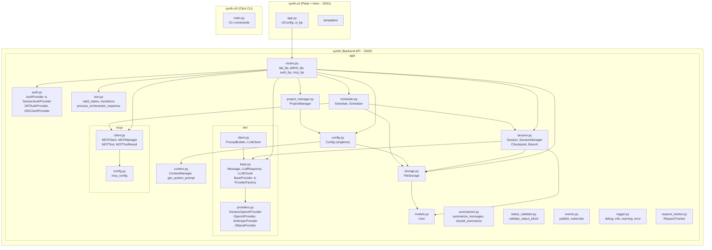
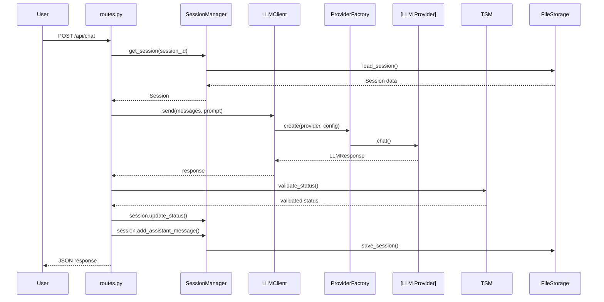
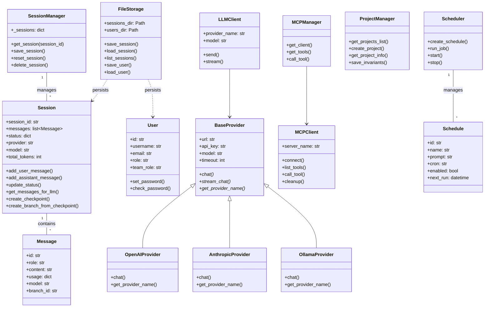
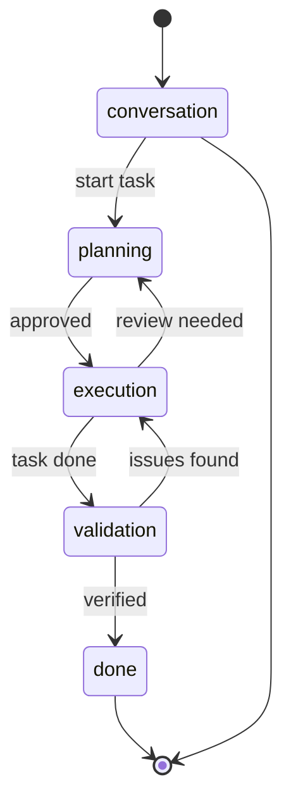

# Архитектура Synth - Диаграмма модулей

## Mermaid диаграмма

```mermaid
graph TB
    subgraph "synth/ (Backend API - :5000)"
        subgraph "app/"
            routes["routes.py<br/>api_bp, admin_bp, auth_bp, mcp_bp"]
            
            session["session.py<br/>Session, SessionManager<br/>Checkpoint, Branch"]
            
            models["models.py<br/>User"]
            
            storage["storage.py<br/>FileStorage"]
            
            config["config.py<br/>Config (singleton)"]
            
            auth["auth.py<br/>AuthProvider ⪯ SessionAuthProvider<br/>JWTAuthProvider, OIDCAuthProvider"]
            
            subgraph "llm/"
                llm_base["base.py<br/>Message, LLMResponse, LLMChunk<br/>BaseProvider ⪯ ProviderFactory"]
                llm_providers["providers.py<br/>GenericOpenAIProvider<br/>OpenAIProvider, AnthropicProvider<br/>OllamaProvider"]
                llm_client["client.py<br/>PromptBuilder, LLMClient"]
            end
            
            tsm["tsm.py<br/>valid_states, transitions<br/>process_orchestrator_response"]
            
            subgraph "mcp/"
                mcp_client["client.py<br/>MCPClient, MCPManager<br/>MCPTool, MCPToolResult"]
                mcp_config["config.py<br/>mcp_config"]
            end
            
            project_mgr["project_manager.py<br/>ProjectManager"]
            scheduler["scheduler.py<br/>Schedule, Scheduler"]
            summarizer["summarizer.py<br/>summarize_messages, should_summarize"]
            status_validator["status_validator.py<br/>validate_status_block"]
            events["events.py<br/>publish, subscribe"]
            context["context.py<br/>ContextManager, get_system_prompt"]
            logger["logger.py<br/>debug, info, warning, error"]
            request_tracker["request_tracker.py<br/>RequestTracker"]
        end
    end
    
    subgraph "synth-ui/ (Flask + htmx - :5001)"
        ui["app.py<br/>UIConfig, ui_bp"]
        templates["templates/"]
    end
    
    subgraph "synth-cli/ (Click CLI)"
        cli["main.py<br/>CLI commands"]
    end
    
    routes --> session
    routes --> config
    routes --> auth
    routes --> llm_base
    routes --> tsm
    routes --> mcp_client
    routes --> project_mgr
    routes --> scheduler
    routes --> storage
    
    session --> models
    session --> storage
    session --> llm_base
    
    storage --> models
    
    config --> storage
    config --> context
    
    llm_base --> llm_providers
    llm_client --> llm_base
    
    mcp_client --> mcp_config
    
    scheduler --> session
    scheduler --> storage
    scheduler --> mcp_client
    
    project_mgr --> config
    
    ui --> routes
```

## Поток данных

```mermaid
sequenceDiagram
    participant U as User
    participant R as routes.py
    participant SM as SessionManager
    participant LLMC as LLMClient
    participant PF as ProviderFactory
    participant P as [LLM Provider]
    participant TS as TSM
    participant FS as FileStorage

    U->>R: POST /api/chat
    R->>SM: get_session(session_id)
    SM->>FS: load_session()
    FS-->>SM: Session data
    SM-->>R: Session
    R->>LLMC: send(messages, prompt)
    LLMC->>PF: create(provider, config)
    PF->>P: chat()
    P-->>LLMC: LLMResponse
    LLMC-->>R: response
    R->>TS: validate_status()
    TS-->>R: validated status
    R->>SM: session.update_status()
    R->>SM: session.add_assistant_message()
    SM->>FS: save_session()
    R-->>U: JSON response
```

## Диаграмма классов (основные компоненты)

```mermaid
classDiagram
    class Session {
        +session_id: str
        +messages: list~Message~
        +status: dict
        +provider: str
        +model: str
        +total_tokens: int
        +add_user_message()
        +add_assistant_message()
        +update_status()
        +get_messages_for_llm()
        +create_checkpoint()
        +create_branch_from_checkpoint()
    }
    
    class SessionManager {
        +_sessions: dict
        +get_session(session_id)
        +save_session()
        +reset_session()
        +delete_session()
    }
    
    class Message {
        +id: str
        +role: str
        +content: str
        +usage: dict
        +model: str
        +branch_id: str
    }
    
    class User {
        +id: str
        +username: str
        +email: str
        +role: str
        +team_role: str
        +set_password()
        +check_password()
    }
    
    class FileStorage {
        +sessions_dir: Path
        +users_dir: Path
        +save_session()
        +load_session()
        +list_sessions()
        +save_user()
        +load_user()
    }
    
    class BaseProvider {
        +url: str
        +api_key: str
        +model: str
        +timeout: int
        +chat()*
        +stream_chat()*
        +get_provider_name()*
    }
    
    class OpenAIProvider {
        +chat()
        +get_provider_name()
    }
    
    class AnthropicProvider {
        +chat()
        +get_provider_name()
    }
    
    class OllamaProvider {
        +chat()
        +get_provider_name()
    }
    
    class LLMClient {
        +provider_name: str
        +model: str
        +send()
        +stream()
    }
    
    class MCPClient {
        +server_name: str
        +connect()
        +list_tools()
        +call_tool()
        +cleanup()
    }
    
    class MCPManager {
        +get_client()
        +get_tools()
        +call_tool()
    }
    
    class ProjectManager {
        +get_projects_list()
        +create_project()
        +get_project_info()
        +save_invariants()
    }
    
    class Schedule {
        +id: str
        +name: str
        +prompt: str
        +cron: str
        +enabled: bool
        +next_run: datetime
    }
    
    class Scheduler {
        +create_schedule()
        +run_job()
        +start()
        +stop()
    }
    
    SessionManager "1" -- "*" Session : manages
    Session "1" -- "*" Message : contains
    FileStorage ..> Session : persists
    FileStorage ..> User : persists
    BaseProvider <|-- OpenAIProvider
    BaseProvider <|-- AnthropicProvider
    BaseProvider <|-- OllamaProvider
    LLMClient --> BaseProvider
    MCPManager --> MCPClient
    Scheduler "1" -- "*" Schedule : manages
```

## State Machine (TSM)

```mermaid
stateDiagram-v2
    [*] --> conversation
    conversation --> planning : start task
    planning --> execution : approved
    execution --> validation : task done
    validation --> done : verified
    validation --> execution : issues found
    execution --> planning : review needed
    done --> [*]
    conversation --> [*]
```
