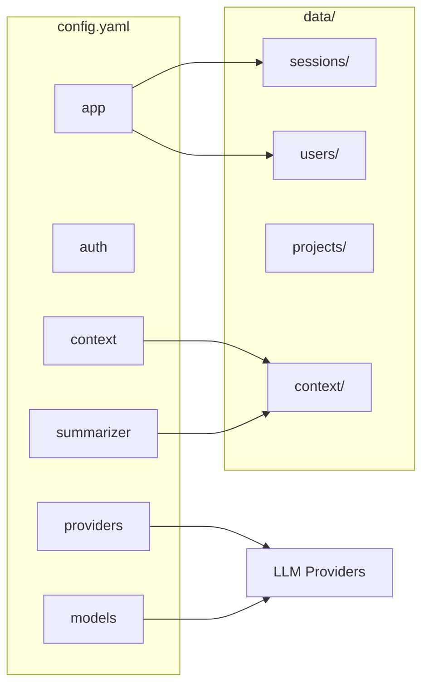

# Конфигурация

## Структура конфигурации

Проект использует YAML файлы конфигурации для каждого компонента:

```
synth/config.yaml       # Backend
synth-ui/config.yaml   # UI
synth-cli/config.yaml  # CLI
```

## Конфигурация Backend (synth/config.yaml)

```yaml
# Основные настройки приложения
app:
  host: "0.0.0.0"
  port: 5000

# Настройки аутентификации
auth:
  api_key: "your-api-key"
  secret_key: "your-secret-key"

# Провайдер по умолчанию
default_provider: "openai"

# Таймауты
timeout: 120
orchestrator_timeout: 300

# Порог предупреждения о токенах
token_warning_percent: 80
token_abort_percent: 95

# Настройки хранилища
storage:
  data_dir: "./data"

# Контекстные файлы
context:
  enabled_files:
    - "SYSTEM.md"
    - "STATUS_SIMPLE.md"

# Настройки суммаризации
summarizer:
  provider: "openai"
  model: "gpt-4o-mini"
  prompt_source: "SUMMARIZER.md"
  temperature: 0.3

summarization:
  default_messages_interval: 10

# Отладочные группы
debug:
  groups:
    ANTHROPIC: "INFO"
    MCP: "INFO"
    ROUTES: "WARNING"
    ORCHESTRATOR: "INFO"

# Модели
models:
  gpt-4o:
    provider: "openai"
    context_window: 128000
    input_price: 2.5
    output_price: 10.0
    enabled: true

  gpt-4o-mini:
    provider: "openai"
    context_window: 128000
    input_price: 0.15
    output_price: 0.6

  claude-3-5-sonnet-20241022:
    provider: "anthropic"
    context_window: 200000
    input_price: 3.0
    output_price: 15.0

# Провайдеры
providers:
  openai:
    url: "https://api.openai.com/v1/chat/completions"
    api_key: "sk-"
    default_model: "gpt-4o"

  anthropic:
    url: "https://api.anthropic.com/v1/messages"
    api_key: "sk-ant-"
    default_model: "claude-3-5-sonnet-20241022"

  ollama:
    url: "http://localhost:11434"
    default_model: "llama3"
```

## Директории данных

```
data/
├── sessions/          # Сессии чата (JSON файлы)
├── users/             # Пользователи (JSON файлы)
├── projects/          # Проекты
│   └── <project>/
│       ├── info.md           # Описание проекта
│       ├── current_task.md   # Текущая задача
│       ├── invariants.yaml   # Инварианты
│       └── schedules.yaml    # Расписания
└── context/           # Контекстные файлы для промптов
    ├── SYSTEM.md
    ├── STATUS_SIMPLE.md
    ├── STATUS_ORCHESTRATOR.md
    ├── TSM_PLANNING.md
    ├── TSM_EXECUTION.md
    └── ...
```

## Переменные окружения

| Переменная | Описание | По умолчанию |
|------------|----------|---------------|
| `T6_SESSION_ID` | ID сессии для CLI | `cli-default` |
| `T6_BACKEND_URL` | URL backend API | `http://localhost:5000` |

## Диаграмма конфигурации


