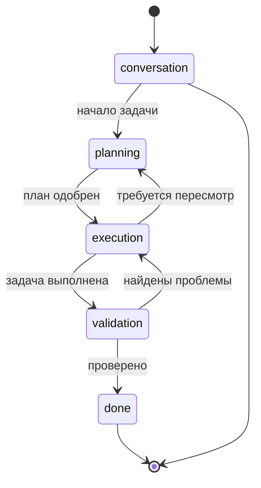
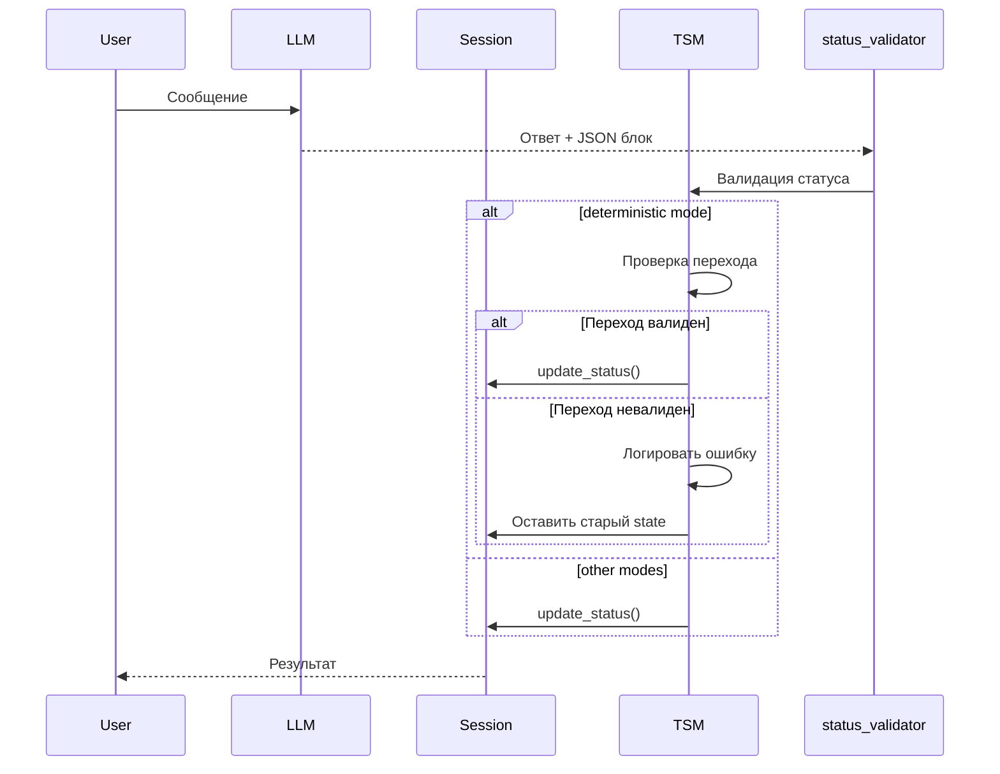

# TSM (Task State Management)

## Обзор

TSM — это система управления состояниями задач, которая позволяет LLM отслеживать прогресс работы над задачей и переключаться между различными этапами.

## Состояния



| Состояние | Описание | Доступные переходы |
|----------|----------|-------------------|
| `conversation` | Свободный разговор | → `planning` |
| `planning` | Планирование задачи | → `execution` |
| `execution` | Выполнение задачи | → `validation`, → `planning` |
| `validation` | Проверка результатов | → `done`, → `execution` |
| `done` | Задача завершена | — |

## Режимы работы

### Simple (простой)
Базовый системный промпт с инструкцией по статусу задачи. Использует файл `STATUS_SIMPLE.md`.

```python
tsm_mode = session.session_settings.get("tsm_mode", "simple")
```

### Orchestrator (оркестратор)
Отдельный system prompt-оркестратор, который:
- Следит за общей картиной
- Запускает подзадачи (subtasks) с собственными промтами
- Координирует работу сабагентов

Использует файл `STATUS_ORCHESTRATOR.md`.

```python
# Пример ответа с подзадачами
{
    "status": {
        "task_name": "Создание API",
        "state": "execution",
        "subtasks": [
            {"id": "1", "name": "Создать модель", "prompt": "..."},
            {"id": "2", "name": "Создать эндпоинты", "prompt": "..."}
        ]
    }
}
```

### Deterministic (детерминированный)
Жёсткая проверка переходов между состояниями с валидацией:
- Проверка допустимости перехода
- Логирование переходов
- Обработка ошибок перехода

```python
# Валидация перехода
is_valid, error = validate_state_transition(current_state, new_state, task_name)
```

## JSON блок статуса

LLM возвращает статус в JSON блоке в конце ответа:

```json
{
    "status": {
        "task_name": "Название задачи",
        "state": "execution",
        "progress": "50%",
        "project": "Название проекта",
        "updated_project_info": "Обновлённое описание",
        "current_task_info": "Информация о текущей задаче",
        "approved_plan": "Одобренный план",
        "already_done": "Уже сделано",
        "currently_doing": "Сейчас делаю",
        "invariants": {
            "язык": "Python",
            "фреймворк": "Flask"
        },
        "schedule": {
            "type": "cron",
            "name": "Ежедневный отчёт",
            "cron": "0 9 * * *"
        }
    }
}
```

## Файлы промптов

| Файл | Использование |
|------|---------------|
| `STATUS_SIMPLE.md` | Простой режим |
| `STATUS_ORCHESTRATOR.md` | Режим оркестратора |
| `STATUS_ORCHESTRATOR_DEBUG.md` | Оркестратор с отладкой |
| `TSM_PLANNING.md` | Планирование |
| `TSM_EXECUTION.md` | Выполнение |
| `TSM_VALIDATION.md` | Проверка |
| `TSM_DONE.md` | Завершение |
| `SCHEDULER.md` | Планировщик |

## Конфигурация

### Установка режима

```python
from app import tsm

# Установить режим
tsm.set_tsm_mode(session, "orchestrator")

# Получить текущий режим
mode = tsm.get_tsm_mode(session)
```

### Получение промпта

```python
prompt = tsm.get_tsm_prompt(session)
```

## Пример работы

```python
# 1. Пользователь начинает задачу
session.status = {"task_name": "conversation", "state": None}

# 2. LLM возвращает новый статус
parsed_status = {
    "task_name": "Новая задача",
    "state": "planning"
}

# 3. Валидация перехода (deterministic mode)
parsed_status = tsm.process_state_transition(session, parsed_status)

# 4. Обновление статуса
session.update_status(parsed_status)

# 5. Результат
print(session.status)
# {'task_name': 'Новая задача', 'state': 'planning', ...}
```

## Диаграмма потока



## Интеграция с проектами

TSM автоматически связывается с системой проектов:

- `project` — название проекта из статуса
- `updated_project_info` — обновлённое описание проекта
- `current_task_info` — текущая задача проекта
- `invariants` — инварианты проекта (язык, фреймворк, ограничения)
- `schedule` — создание расписаний

## Память задачи (Task Memory)

Память задачи — это структура данных в сессии, которая сохраняет контекст диалога: что пользователь уже уточнил, какие ограничения зафиксированы, и чем является цель текущего разговора.

### Структура памяти задачи

Все данные хранятся в `session.status`:

| Поле | Описание | Пример |
|------|----------|--------|
| `task_name` | Название текущей задачи | `"Написание API"`, `"разговор на свободную тему"` |
| `project` | Название проекта | `"МойПроект"`, `null` |
| `updated_project_info` | Полное описание проекта | `"# Проект: МойПроект\n\n## Описание\n..."` |
| `current_task_info` | Информация о текущей задаче | `"Документация API"`, `null` |
| `approved_plan` | Утверждённый план работы | `"1. Введение 2. API 3. Тесты"`, `null` |
| `invariants` | Ограничения и правила | `{"язык": "Python", "фреймворк": "FastAPI", "не использовать": ["Django"]}` |

> **Примечание:** Поле `user_info` не относится к памяти задачи — оно используется для заполнения профиля пользователя, проведения интервью и подобных сценариев.

### Как работает память

1. **Начало диалога**: `task_name = "разговор на свободную тему"`, остальные поля `null`

2. **Пользователь уточняет**:
   - LLM фиксирует уточнения в `invariants`
   - Пример: пользователь сказал "используй Python, но не Django" → сохраняется в `invariants`

3. **Создание проекта**:
   - LLM устанавливает `project` и `updated_project_info`
   - В `updated_project_info` хранится полное описание: участники, технологии, особенности

4. **Постановка задачи**:
   - `task_name` → название задачи
   - `current_task_info` → описание текущей подзадачи
   - `approved_plan` → план работы (после утверждения)

5. **Сохранение прогресса**:
   - `already_done` — что уже сделано
   - `currently_doing` — что делается сейчас
   - `progress` — прогресс внутри этапа

### Примеры

#### Пользователь начинает обсуждение проекта

```json
{
  "status": {
    "task_name": "Создание проекта",
    "state": "planning",
    "project": "НовыйПроект",
    "updated_project_info": null,
    "current_task_info": null,
    "approved_plan": null,
    "invariants": null
  }
}
```

#### LLM фиксирует уточнения

```json
{
  "status": {
    "task_name": "Создание проекта",
    "state": "planning",
    "project": "НовыйПроект",
    "updated_project_info": null,
    "current_task_info": null,
    "approved_plan": null,
    "invariants": {
      "язык": "Python",
      "не использовать": ["Django", "Flask"],
      "лицензия": "MIT"
    }
  }
}
```

#### Проект создан, описание сохранено

```json
{
  "status": {
    "task_name": "Создание проекта",
    "state": "done",
    "project": "НовыйПроект",
    "updated_project_info": "# Проект: НовыйПроект\n\n## Описание\nВеб-приложение для управления задачами (Todo-лист)\n\n## Участники\n- Иван (разработчик)\n\n## Технологии\n- Python\n- FastAPI\n- PostgreSQL\n\n## Бюджет\n50 тыс. руб.\n\n## Срок\n1 месяц\n\n## Особенности\n- REST API\n- JWT авторизация\n\n## Инварианты\n- Язык: Python\n- Не использовать: Django, Flask\n- Лицензия: MIT",
    "current_task_info": "Первая задача",
    "approved_plan": null,
    "invariants": {
      "язык": "Python",
      "не использовать": ["Django", "Flask"],
      "лицензия": "MIT"
    }
  }
}
```

### Доступ из кода

```python
from app.session import session_manager

session = session_manager.get_session(session_id)

# Чтение памяти задачи
task_name = session.status.get("task_name")
project = session.status.get("project")
invariants = session.status.get("invariants")

# Обновление (через LLM ответ)
session.update_status({
    "task_name": "Новая задача",
    "invariants": {"язык": "Python"}
})
```

### Контекстная оптимизация

Память задачи (status) сохраняется в каждом сообщении assistant и передаётся LLM. При использовании контекстной оптимизации (summarization, sliding window) важные данные из status остаются в контексте.
